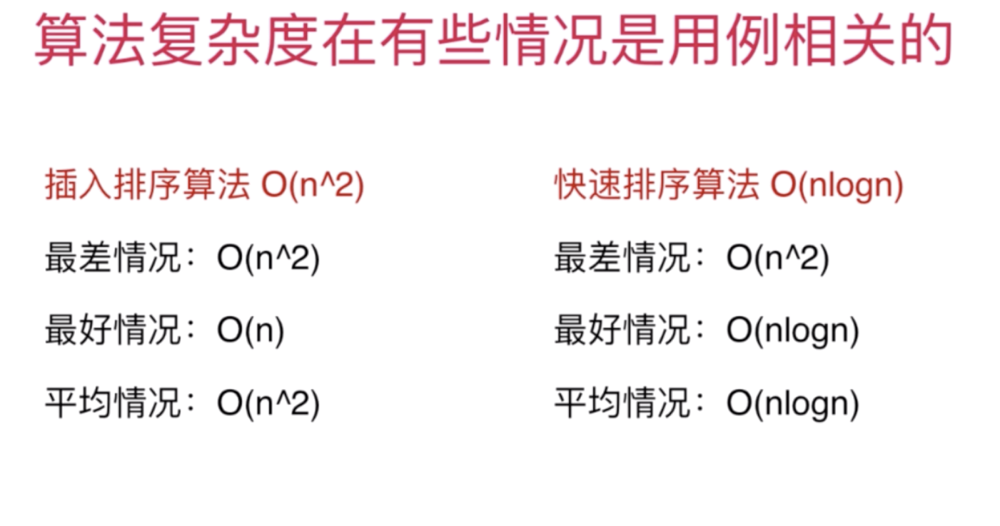

# 玩转算法面试

## 算法面试不是高考。

把这个问题看作是和面试官一起探讨问题的解决方案。

问题的细节和应用环境，可以和面试官沟通。

“正确“是相同的。

### 问题：我们需要对一组数据进行排序。

排序快速的确是快，但是不一定是满意的。可能我们在遇到问题，都不是最优的。

这组数据有什么特征？

#### 有没有可能包含有大量重复的元素？

#### 是否是真的近乎排好序了？

#### 是否数据的取值范围非常有限？

#### 是否需要稳定的排序？

#### 数据存储结构？归并排序

#### 大小是否可以装在内存中？

#### 如果是非常难的问题，对你的竞争对手来说，也是难的。 关键在于你所表达出的解决问题的思路。 甚至通过表达解题思路的方向，得出结论：这个问题的解决方案， 应该在哪一个领域，我可以通过查阅或者进一步学习解决问题。

### 算法面试只是技术面试的一部分。

算法面试只是技术面试的一部分。 根据你的简历和应聘职位的不同，势必要考察其他技术方面。

### 项目经历和项目中遇到的实际问题

### 你遇到的印象最深的bug是什么？

面向对象 设计模式 网络相关；安全相关；内存相关；并发相关，

系统设计；scalability.....

#### 技术面试优秀不意味着能够拿到Offer 

技术面试只是面试的一部分。面试不仅仅是考察你的技术水平，还是了解你的过去以及形成的思考行为方式。

### 项目经历

创建自己的项目 

自己做小应用、计划表；备忘录；播放器， 

自己解决小问题：爬虫，数据分析；词频统计

#### 通过过去了解你的思考行为方式 

#### 遇到的最大的挑战？

#### 犯过的错误？ 

#### 遭遇的失败？

#### 最享受的工作内容？ 

#### 遇到冲突的处理方式？ 

#### 做的最与众不同的事？

准备好合适的问题问面试官 

#### 整个小组的大概运行模式是怎样的？

#### 整个项目的后续规划是如何的？ 

#### 这个产品中的某个问题是如何解决的？

#### 为什么会选择某些技术？标准？

#### 我对某个技术很感兴趣，在你的小组中我会有怎样的机会深入这种技术？

准备面试和准备算法面试

算法面试，只是面试中的一个环节。

### 如何解决算法面试问题的整体思路

注意题目中的条件 

给定一个有序数组， 有一些题目中的条件本质是暗示：

* 设计一个O（n\|ogn）的算法 
* 无需考虑额外的空间
* 数据规模大概是10000

#### 当没有思路的时候

自己给自己几个简单的测试用例，试验一下 

不要忽视暴力解法。暴力解法通常是思考的起

### 优化算法

遍历常见的算法思路 

遍历常见的数据结构 

空间和时间的交换（哈希表）

预处理（排序）

## 时间复杂度

到底什么是O\(n\),n 表示数据规模

O\(f\(n\)\)表示运行算法所需要执行的指令数，和f（n）成正比。

| ** 面试leetcode题目 **  | python |
| :---  |  :--- |
| ** 第一章 数组基础 **  | python |
| 1-1 BinarySearch   |[python](./Chapter01_ArrayProblem/BinarySearch.py)|
| 1-2 即使简单的问题，也有很多优化的思路 | 283 27 26 80 |
| 1-3 三路快排partition思路的应用 Sort Color | 75 88 215 |
| 1-4 对撞指针 Two Sum II - Input Array is Sorted | 167 125 344 345 11 |
| 1-5 滑动窗口 Minimum Size Subarray Sum | 209 3 438 76 |
| **第二章 查找表相关问题** | | |
| 2-1 set的使用 Intersection of Two Arrays | 349 |
| 2-2 map的使用 Intersection of Two Arrays II | 350 |
| 2-3 set和map不同底层实现的区别 | 349 350 136 242 202 290 205 451 |
| 2-4 使用查找表的经典问题 Two Sum | 1 15 18 16 
| 2-5 灵活选择键值 4Sum II | 454  49 |
| 2-6 灵活选择键值 Number of Boomerangs | 447  149 719 |
| 2-7 查找表和滑动窗口 Contain Duplicate II | 219 |
| 2-8 二分搜索树底层实现的顺序性 Contain Duplicate III | 220 |
| **第三章 在链表中穿针引线** | | |
| 3-1 链表，在节点间穿针引线 Reverse Linked List | 206  92 |
| 3-2 测试你的链表程序 | 206 83 86 328 2 445 |
| 3-3 设立链表的虚拟头结点 Remove Linked List Elements | 203  82 21 |
| 3-4 复杂的穿针引线 Swap Nodes in Pairs | 24  25 147 148 |
| 3-5 不仅仅是穿针引线 Delete Node in a Linked List | 237  |
| 3-6 链表与双指针 Remove Nth Node Form End of List | 19  61 143 234 |
| **第四章 栈、队列、优先队列** | | |
| 6-1 栈的基础应用 Valid Parentheses | 20  150 71 |
| 6-2 栈和递归的紧密关系 Binary Tree Preorder, Inorder and Postorder Traversal | 144 94 145 |
| 6-3 运用栈模拟递归 | 144 94 145  341 |
| 6-4 队列的典型应用 Binary Tree Level Order Traversal | 102  107 103 199 346 |
| 6-5 BFS和图的最短路径 Perfect Squares | 279  127 126 286 |
| 6-6 优先队列 | [无] | [无] |
| 6-7 优先队列相关的算法问题 Top K Frequent Elements | 347  23 |
| **第五章 二叉树和递归** | | 
| 7-1 二叉树天然的递归结构 | 104  111 |
| 7-2 一个简单的二叉树问题引发的血案 Invert Binary Tree | 226  100 101 222 110 |
| 7-3 注意递归的终止条件 Path Sum | 112  111 404 |
| 7-4 定义递归问题 Binary Tree Path | 257  113 129 222 |
| 7-5 稍复杂的递归逻辑 Path Sum III | 437  |
| 7-6 二分搜索树中的问题 Lowest Common Ancestor of a Binary Search Tree | 783 235  98 450 108 230 236 530 |
| **第六章 递归和回溯法** | | | | |
| 8-1 树形问题 Letter Combinations of a Phone Number | 17 | [无] 
| 8-2 什么是回溯 | 17 | 93 131 |
| 8-3 排列问题 Permutations | 46 | 47 
| 8-4 组合问题 Combinations | 77 | [无] |
| 8-5 回溯法解决组合问题的优化 | 77 | 39 40 216 78 90 401 |
| 8-6 二维平面上的回溯法 Word Search | 79 | [无] |
| 8-7 floodfill算法，一类经典问题 Number of Islands | 200 | 130 417 |
| 8-8 回溯法是经典人工智能的基础 N Queens | 51 | 52 37 |
| **第七章 动态规划基础** | | |
| 9-1 什么是动态规划 | [无] | [无] |
| 9-2 第一个动态规划问题 Climbing Stairs | 70 | 120 64 |
| 9-3 发现重叠子问题 Integer Break | 343 | 279 91 62 63 |
| 9-4 状态的定义和状态转移 House Robber | 198 | 213 337 309 |
| 9-5 0-1背包问题 | [无] | [无] |
| 9-6 0-1背包问题的优化和变种 | [无] | [无] |
| 9-7 面试中的0-1背包问题 Partition Equal Subset Sum | 416 | 322 377 474 139 494 |
| 9-8 LIS问题 Longest Increasing Subsequence | 300 | 376 |
| 9-9 LCS，最短路，求动态规划的具体解以及更多 | [无] | [无] |
| **第八章 贪心算法** | | |
| 10-1 贪心基础 Assign Cookies | 455 | 392 |
| 10-2 贪心算法与动态规划的关系 Non-overlapping Intervals | 435 | [无] |
| 10-3 贪心选择性质的证明 | [无] | [无] |